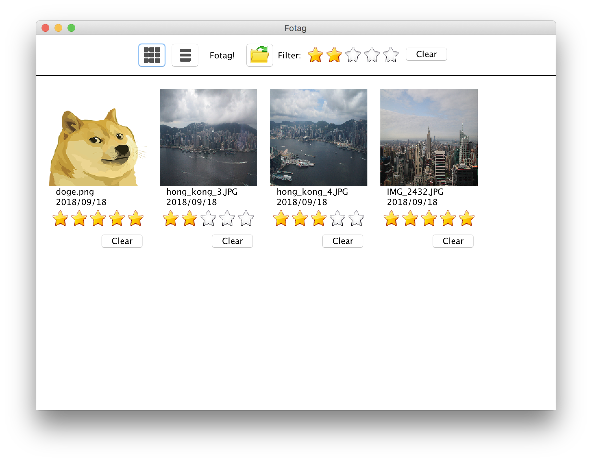
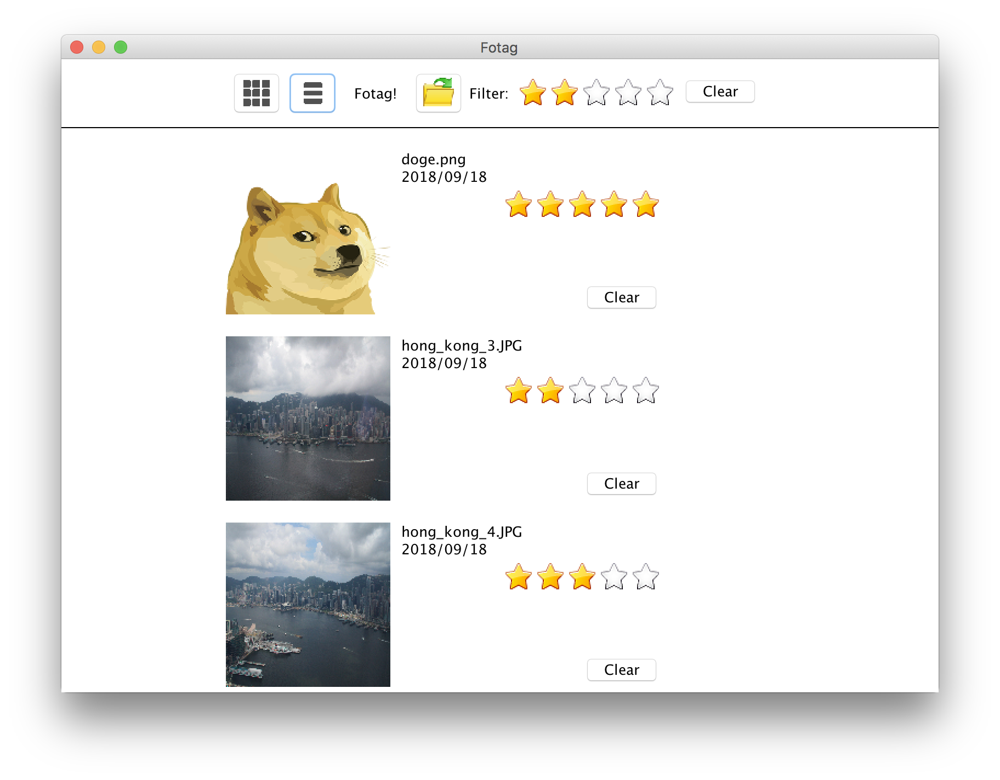

# Image Viewer (MVC in Java)

## Description

Awn interactive application that allows users to load images, and display the images and metadata in a dynamic layout. Users can rate images, and filter them based on this rating.

## Development Environment

- The program is written in `Java` using `JVM 10`.
- run with `./gradlew run`.
- Built on `macOS 10.13.5`.

## Available Functions

### Toolbar

- grid and list toggle to change layout
- a file icon to open new images
    - can select multiple images at once
- a filter system as described in the assignment, with a clear button clear filter

### Images

- Each image contains:
    - the image
    - file name
    - creation date (the date image is added to the application)
    - rating (initialized to 0)
- The user can click on the image to open the image in a new window, click "x" to dismiss the new window. (it won't close the application)
- The rating behaviour is as described in the assignment

### Dynamic Layout

- grid layout
    - adjusted based on the size of the screen
    - metadata displayed below the image
    - no scrollbar implemented (which is not specified)
- list layout
    - a single column
    - metadata displayed right side of the image
    - no scrollbar implemented (which is not specified)
